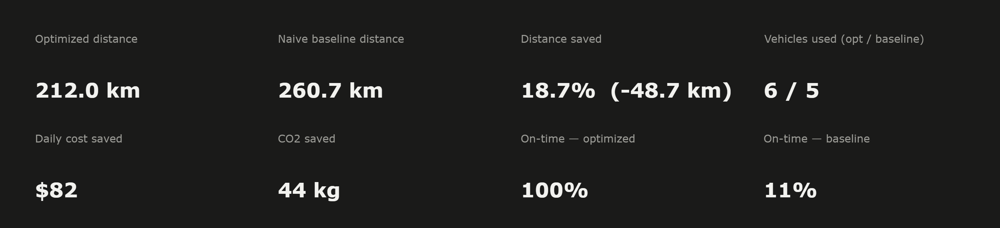

# 45 Deliveries. 45 Promised Time Slots. One Dispatcher Blows 40 of Them.

**[Live dashboard →](https://route-optimization-vrp.streamlit.app)**

A fictional Burbank distribution center needs to get 231 packages to 45 stops
across the LA basin today — each stop with its own 2-hour delivery window.
Two dispatchers plan the routes independently:

- **Dispatcher A** does what most small fleets still do without route software —
  drive to whichever unvisited stop is closest, truck by truck, until it's full.
  It never looks at the clock.
- **Dispatcher B** hands the same stops, same trucks, same capacity limits,
  and the same delivery windows to
  [Google OR-Tools](https://developers.google.com/optimization) and lets a
  constraint solver work it out.

Same demand. Same fleet. Same day. Same promises to customers.



| | Dispatcher A (nearest-neighbor) | Dispatcher B (OR-Tools CVRP + time windows) |
|---|---|---|
| Total distance | 260.7 km | **212.0 km** |
| Trucks used | 5 | 6 |
| Distance saved | — | **18.7% (−48.7 km)** |
| Delivery windows hit | **5 / 45 (11%)** | **45 / 45 (100%)** |
| Daily cost saved (fuel + labor) | — | **~$82/day** |
| CO2 saved | — | **~44 kg/day** |

Dispatcher B needs one extra truck to guarantee every window — but still drives
less overall, and turns an 89%-miss rate into a 100%-hit rate.


*Dispatcher A: each truck greedily chases the nearest stop with no idea what time it promised to be there. Routes cross each other repeatedly.*


*Dispatcher B: same trucks, same stops, but every arrival lands inside its 2-hour window.*

## Why nearest-neighbor loses twice

Greedy nearest-neighbor is locally smart and globally blind: it never asks
"will chasing this close stop now strand me on the wrong side of the map
later?" — and it's *entirely* blind to time, so it can arrive at a stop hours
before or after the window a customer was promised. With 45 stops split
across a capacity limit and a 10-hour business day, those blind spots
compound into both wasted mileage (crossing routes above) and a delivery SLA
that fails 4 times out of 5. OR-Tools solves the whole
assignment-ordering-and-scheduling problem at once (Capacitated Vehicle
Routing Problem with Time Windows, or CVRPTW), trading a few seconds of
compute — and, here, one extra truck — for a plan that is both shorter and
reliable.

## How the solver works

1. **Distance & time matrices** — haversine great-circle distance between all
   46 points (depot + 45 stops), converted to travel time at a configurable
   average urban delivery speed (25 km/h default — stop-and-go, not highway).
2. **Capacity constraint** — each truck has a package limit; OR-Tools' routing
   dimension API enforces it per vehicle.
3. **Time windows** — each stop gets a randomly-placed 2-hour delivery window
   inside an 8am–6pm horizon, plus a 5-minute service time. A second routing
   dimension tracks cumulative time per vehicle and constrains every stop's
   arrival to fall inside its window.
4. **Disjunction with penalty** — every stop *can* be dropped, but only at a
   steep cost, so the solver still returns a usable (if partial) plan when a
   configuration is genuinely infeasible — on capacity *or* time — instead of
   failing outright.
5. **Search strategy** — `PATH_CHEAPEST_ARC` for a first feasible solution,
   then `GUIDED_LOCAL_SEARCH` metaheuristic to improve it within a time budget
   (default 10s, configurable in the app). A small span-cost penalty on the
   time dimension discourages the solver from padding routes with pointless
   idle waiting once a schedule is already window-feasible.

```
data/stops.csv → distance matrix (haversine) → time matrix (avg speed)
                        │
        ┌───────────────┴───────────────┐
        ▼                               ▼
 nearest-neighbor                  OR-Tools CVRPTW
   baseline                    (capacity + time windows +
  (blind to time)               disjunction + guided local search)
        │                               │
        └───────────────┬───────────────┘
                         ▼
              Streamlit dashboard
   (map, KPIs, cost/CO2 business case, delivery schedule, live controls)
```

## The business case

Distance saved is nice; money and reliability are what a dispatcher actually
cares about. The dashboard sidebar exposes the assumptions behind the dollar
and CO2 numbers as **editable inputs** — fuel + maintenance ($/km), driver
wage ($/hour), and CO2 emissions (kg/km) — so the savings aren't a fixed,
unverifiable number but something you can tune to your own fleet's real
costs. A "Delivery schedule" table shows every stop's ETA against its
promised window, and an on-time-rate KPI turns the whole comparison into an
SLA-compliance story a non-technical stakeholder can read at a glance.

## Try it yourself

The dashboard lets you change the fleet size, per-truck capacity, average
delivery speed, solver time budget, and cost assumptions, and watch both
plans (and the business case) re-solve live.

```bash
uv sync
uv run streamlit run src/app.py
```

Regenerate the dataset (45 stops around real LA neighborhoods — Glendale,
Pasadena, Hollywood, Downtown LA, Silver Lake, and more, each with a package
demand and a 2-hour delivery window) or re-run either solver from the CLI:

```bash
uv run python src/generate_data.py
uv run python src/cvrp_solver.py
uv run python src/baseline_solver.py
```

## Tech stack

Python · Google OR-Tools (constraint programming + local search, capacity and
time-window dimensions) · Streamlit · Plotly (Scattermap) · pandas/numpy ·
pytest · GitHub Actions

## Repo structure

```
src/
  generate_data.py         synthetic LA delivery dataset — stops, demand, service time, time windows
  distance.py               haversine distance matrix + travel-time conversion
  cvrp_solver.py            OR-Tools CVRPTW solver (capacity + time windows)
  baseline_solver.py        naive nearest-neighbor baseline (blind to time) + ETA simulation
  app.py                    Streamlit dashboard (routes, KPIs, business case, delivery schedule)
  export_readme_images.py   static image export for this README
tests/                      pytest suite — feasibility, capacity, time windows, determinism
data/stops.csv               generated dataset (depot + 45 stops)
```
